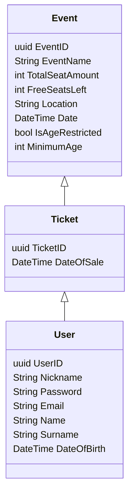

# ktu-didvyriai

## DB schema

```mermaid
classDiagram

    Event <|-- Ticket
    Ticket <|-- User

    class Event {
        uuid EventID
        String EventName
        int TotalSeatAmount
        int FreeSeatsLeft
        String Location
        DateTime Date
        bool IsAgeRestricted
        int MinimumAge
    }

    class Ticket {
        uuid TicketID 
        DateTime DateOfSale
    }

    class User {
        uuid UserID
        String Nickname
        String Password
        String Email
        String Name
        String Surname
        DateTime DateOfBirth
    }
```